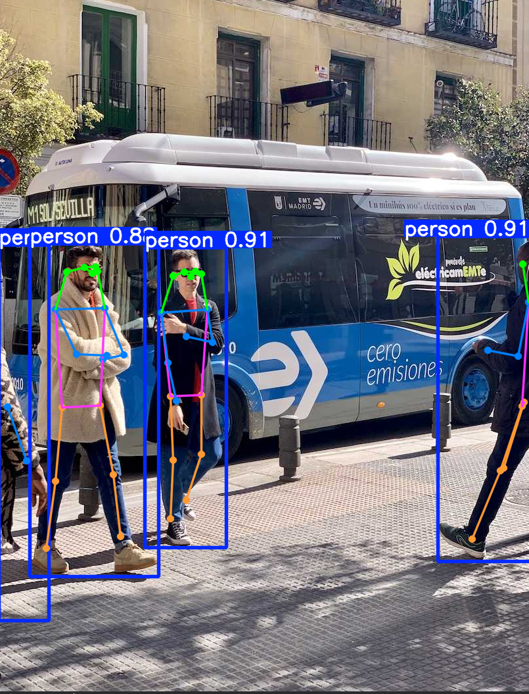
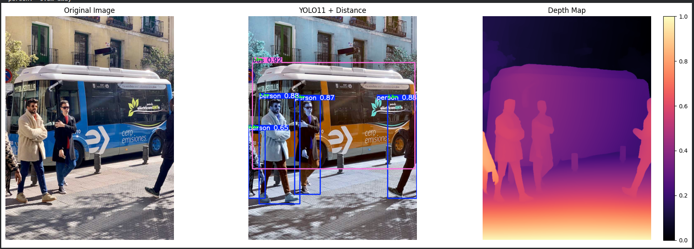

# Computer Vision Journey 🚀

This repository documents my journey of learning **Computer Vision** from zero coding experience to building real-world projects using CNNs and YOLO11.

**Started:** May 202**Week 4 In Progress**

---

## 📌 About This Repository

I am systematically learning modern Computer Vision with a strong focus on **practical skills**.

Following a structured 3-month learning plan.

---

## 🛠 Technologies & Tools

- **Ultralytics YOLO11** (Detection, Segmentation, Pose, Tracking)
- Depth-Anything V2 (Depth Estimation)
- MediaPipe & OpenCV
- Roboflow (Datasets)
- Gradio (Web Demos)
- Hugging Face
---

## 📂 Progress Overview

### Week 1: Foundations
- Hugging Face Pipelines
- YOLO11 Inference & Visualization
- First Custom Training

### Week 2: Custom Projects
- Waste Detection System
- Vehicle Detection
- Tracking & Counting

### Week 3: Advanced Topics (Completed)
- Instance Segmentation Analysis
- Pose Estimation
- Action Recognition
- Zero-Shot Detection (CLIP + YOLO)
- Model Quantization & Optimization
- Anomaly Detection

### Week 4: 3D Understanding
- **Depth Estimation + Distance Calculation** (YOLO11 + Depth-Anything V2)

---

## 📌 Featured Projects & Results

### 1. Smart Traffic AI
- Vehicle detection, tracking & counting
- Live Demo: [Hugging Face Space](https://huggingface.co/spaces/Hayat373/smart-traffic-ai)

### 2. Pose Estimation

### 3. Depth Estimation + Distance

---
## 📂 Repository Structure

computer-vision-journey/
├── week1-basics/
├── week2-projects/
├── week3-advanced/
├── week4-depth/
├── results/                  ← Screenshots & Results
├── projects/                 ← Polished projects (moved to cv-portfolio later)
└── README.md

## 🚀 How to Run the Notebooks

All notebooks are designed to run in **Google Colab** (with GPU).

1. Open any notebook
2. Go to `Runtime` → `Run all`
3. (Optional) Change runtime type to **T4 GPU**

---

## 📌 Goals for Next 4 Weeks

- Build 3 strong portfolio projects
- Improve model deployment skills
- Participate in AI hackathons
- Prepare for freelance and junior CV roles
---

## 🤝 Connect With Me

- LinkedIn: [https://www.linkedin.com/in/hayat-ahmedjara](https://www.linkedin.com/in/hayat-ahmedjara)
- Email: hayahmam3@gmail.com

---

## ⭐ Star this repo if you find it helpful!

Feel free to explore, learn together, or suggest improvements.

---

**"From zero coding to building advanced Computer Vision systems — documenting my journey one day at a time."**

Made with ❤️ in Addis Ababa, Ethiopia
