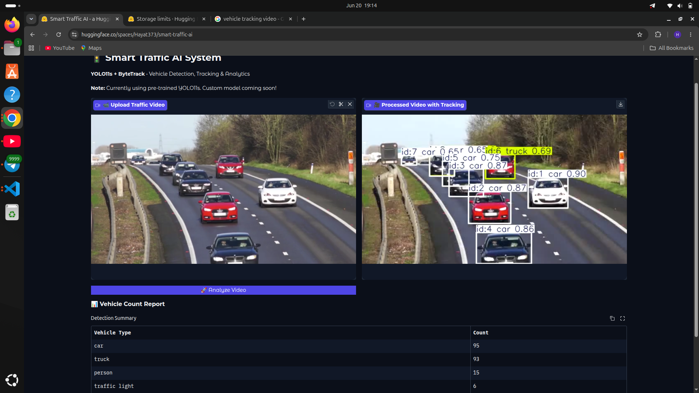

# 🚦 Smart Traffic AI System

**Real-time Vehicle Detection, Tracking & Analytics** using **YOLO11 + ByteTrack**

## ✨ Live Demo
👉 **[Try the App Here](https://huggingface.co/spaces/Hayat373/smart-traffic-ai)**

## ✨ Features
- Vehicle detection (car, bus, truck, motorcycle, etc.)
- Multi-object tracking with unique IDs
- Accurate counting (no double counting)
- Processed video with visual tracking

## 🛠 Technologies
- YOLO11s (Ultralytics)
- ByteTrack Tracker
- Gradio Interface

## How to Use
1. Upload a traffic video
2. Click **Analyze Video**
3. Get tracked video + vehicle count report

---

**Part of my [Computer Vision Journey](https://github.com/Hayat373/computer-vision-journey)**  
